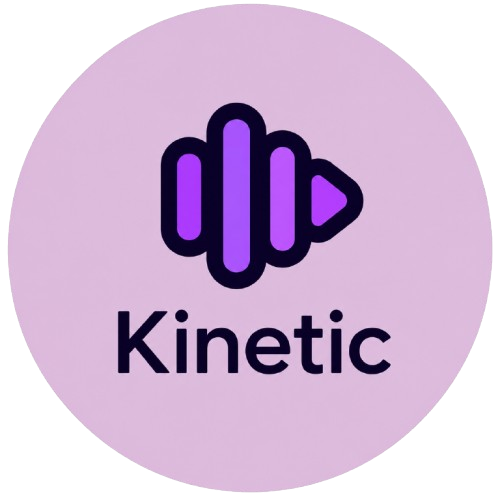

# 🎵 Kinetic Music Player

<p align="center">
  
</p>

<p align="center">
  <strong>A Modern, Fast & Responsive Web Music Player</strong>
</p>

<p align="center">
  Search, discover, and enjoy music with a beautiful interface, real-time weather integration, dynamic playlists, and an immersive listening experience.
</p>

---

## 📌 Features

### 🎧 Music Experience
- Modern and responsive UI
- Search songs instantly
- Play, Pause, Next & Previous controls
- Shuffle & Repeat modes
- Volume control
- Seek/Progress bar
- Album artwork
- Song duration display
- Recently played songs
- Favorite songs
- Dynamic playlists

### 🌍 Smart Features
- Dynamic background based on weather
- Location-aware experience
- Fast song loading
- Responsive design for Desktop, Tablet & Mobile

### 🚀 Performance
- Optimized loading
- Lazy loading
- Smooth animations
- Fast search
- Local caching
- Lightweight architecture

---

# 📂 Project Structure

```
Kinetic/
│
├── KineticStyles.css
├── KineticScript.js
├── images
├── songs/
├── Kinetic.html
├── README.md
├── LICENSE
├── favicon.ico
└── manifest.json
```

---

# 🚀 Getting Started

## Clone Repository

```bash
git clone https://github.com/ProgramWithAsim/Kinetic.git
```

Open the project

```bash
cd Kinetic
```

Open

```
https://programwithasim.github.io/Kinetic/kinetic.html
```

or run using **Live Server** in Visual Studio Code.

---

# 🌐 Deployment

You can deploy this project using:

- GitHub Pages
- Netlify (Recommended)
- Vercel
- Firebase Hosting

---

# 💻 Technologies Used

- HTML5
- CSS3
- JavaScript (ES6)
- Responsive Web Design
- Fetch API
- Music APIs

---

# 📱 Browser Support

✔ Google Chrome

✔ Microsoft Edge

✔ Mozilla Firefox

✔ Opera

✔ Brave

✔ Safari

---

# 🎵 Music Library

The player supports:

- Trending Songs
- Popular Artists
- Dynamic Song Search
- Playlist Refresh
- Modern UI Navigation

---

# 📷 Screenshots

> 

```
screenshots/ Home.png
```

---

# ⚙️ Future Improvements

- AI Music Recommendations
- Lyrics Support
- User Accounts
- Dark / Light Themes
- Offline Playback
- Playlist Export
- Equalizer
- Sleep Timer
- Crossfade
- Multiple Music APIs
- Smart Recommendations

---

# 🤝 Contributing

Contributions are welcome!

1. Fork the repository
2. Create your feature branch

```bash
git checkout -b feature/NewFeature
```

3. Commit your changes

```bash
git commit -m "Added New Feature"
```

4. Push to the branch

```bash
git push origin feature/NewFeature
```

5. Open a Pull Request

---

# 📜 License

This project is licensed under the **MIT License**.

You are free to:

- Use
- Modify
- Distribute
- Fork

Please include the original license when redistributing.

---

# 👨‍💻 Developer

**Shaikh Mohd Asim**

Computer Teacher • Web Developer • Programming Enthusiast

GitHub:
https://github.com/ProgramWithAsim

---

# ⭐ Support

If you like this project,

⭐ Star the repository

🍴 Fork it

📢 Share it

Your support helps improve Kinetic!

---

## 🎶 Enjoy Your Music Experience!

Made with ❤️ using HTML, CSS & JavaScript.
